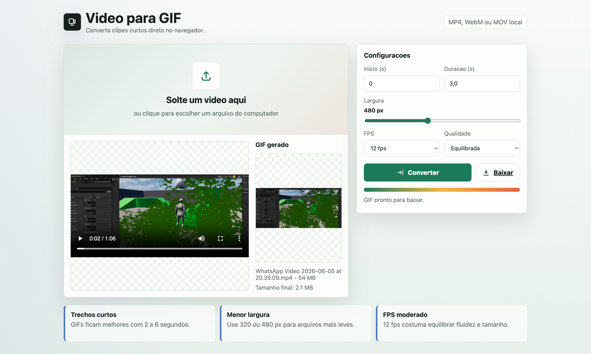

# Video para GIF

Webapp simples para converter trechos de videos em GIF direto no navegador.

## Preview



## Como funciona

O app roda totalmente no navegador:

1. Voce seleciona ou arrasta um arquivo de video.
2. O navegador carrega o video e mostra um preview.
3. Voce escolhe o trecho do GIF usando inicio e duracao.
4. Tambem pode ajustar o trecho pela barra visual com inicio e fim.
5. O app captura frames do video em um `canvas`.
6. A biblioteca `gif.js` transforma esses frames em um arquivo `.gif`.
7. O GIF gerado aparece na tela e pode ser baixado pelo botao **Baixar**.

Nenhum video e enviado para servidor. A conversao acontece localmente no seu computador.

## Recursos

- Upload por clique ou arrastar e soltar.
- Preview do video selecionado.
- Seletor visual de range para escolher o trecho do GIF.
- Controle de inicio e duracao do trecho.
- Ajuste de largura do GIF.
- Escolha de FPS.
- Escolha de qualidade.
- Preview do GIF gerado.
- Download do arquivo final.

## Estrutura do projeto

```txt
video-gif-converter/
├── index.html
├── gif.js
├── gif.worker.js
└── README.md
```

## Como rodar

Inicie um servidor local:

```bash
python3 -m http.server 4173
```

Abra no navegador:

```txt
http://127.0.0.1:4173/
```

## Uso

1. Clique na area de upload ou arraste um video para a tela.
2. Ajuste o trecho pela barra **Trecho do GIF** ou pelos campos **Inicio** e **Duracao**.
3. Ajuste **Largura**, **FPS** e **Qualidade**.
4. Clique em **Converter**.
5. Espere o processamento terminar.
6. Clique em **Baixar** para salvar o GIF.

## Observacoes

- GIFs ficam melhores com trechos curtos, normalmente entre 2 e 6 segundos.
- Diminuir a largura reduz bastante o tamanho final do arquivo.
- FPS maior deixa o movimento mais fluido, mas tambem aumenta o tamanho do GIF.
- Arquivos grandes podem demorar mais para processar, porque tudo acontece no navegador.

## Dependencias

As dependencias ja estao incluidas no projeto:

- `gif.js`
- `gif.worker.js`

Por isso, depois que os arquivos estao na pasta, o app nao precisa baixar a biblioteca de um CDN para converter os videos.
